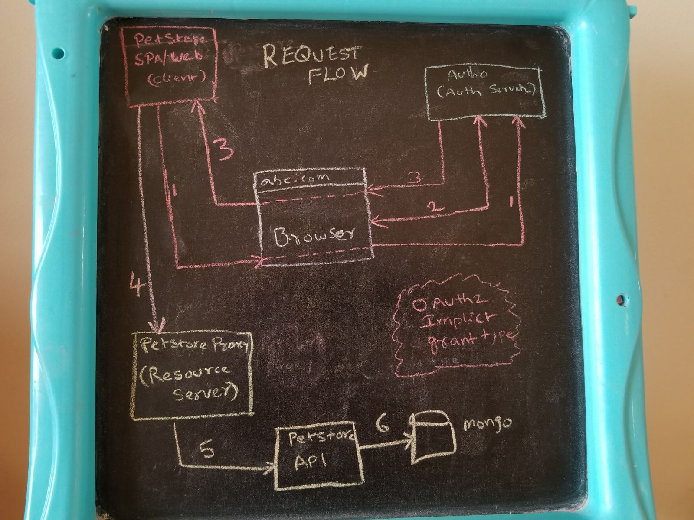
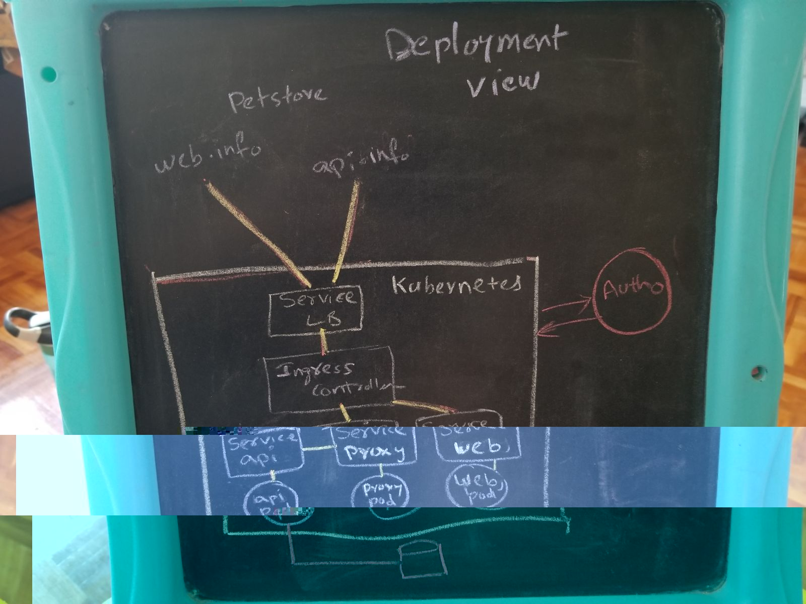

# Solution at a glance 

You can find the Soultion and Request flows followed for this usecase in below sections. I will focus on these improvements in near future.

## Current Solution ##
The current solution includes OAuth 2.0 authorization framework (Implict Grant) to perform authentication between SPA + API applicaitons.

Here are the various OAuth roles involved in this solution:

* Resouce Owner/Server: (petstore-proxy)
    * the server hosting the protected resources. This is the API you want to access.
    * the entity that can grant access to a protected resource. Typically this is the end-user.
         
* SPA Client: (petstore-web)
    * an application requesting access to a protected resource on behalf of the Resource Owner. 

* Authorization Server: (Auth0)
    * the server that authenticates the Resource Owner, and issues Access Tokens after getting proper authorization. In this case, Auth0.
   
* Resource API: (Petstore-api)
    * the server that authenticates the Resource Owner, and issues Access Tokens after getting proper authorization. In this case, Auth0.

## Request Flow ##

1. The app initiates the flow and redirects the browser to Auth0 (specifically to the /authorize endpoint), so the user can authenticate.

2. Auth0 authenticates the user. The first time the user goes through this flow, and if the application is a third party application, a consent page will be shown where the permissions, that will be given to the Client, are listed (for example, post messages, list contacts, and so forth).

3. Auth0 redirects the user to the app with an access_token (and optionally an id_token) in the hash fragment of the URI. The app can now extract the tokens from the hash fragment.

4. The app can use the access_token to call the API on behalf of the user.

5. Request will proxy pass after authorization from the proxy (Resource server)

6. Petstore API perfroms CURD operations against DB, without knowing who is performing these operations.

## Deployment View 

Here is the deployment view at a high level. Please note, this is logical deployment view of the minikube kubernetes cluster. Not specified internals of the kubernetes like service-discovery, config mngt, kube-dns, kube-sidecar etc.,

## Improvements

1. Replace the petstore-proxy with any API Gateway solutions like KONG, Apigee etc.,
2. Can refactor the petstore-api (Spring Boot) application with multiple modules instead of single application
